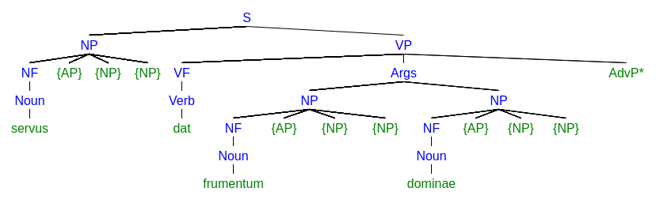

# Latin->German Earley Translator

This program can read a Latin sentence to translate it into another language (currently only German).
It follows a rule-based approach that extend the concept of Context Free Grammars (CFG) with variable form parameters that denote whether a word is singular/plural, which person, tense, voice, etc. it has.
By extending the CFG's production rules to enforce constraints on the form parameters of symbols, congruencies between different sentences can be enforced.
This is especially important for Latin.
To generate a syntax tree of a given Latin source sentence, we use an adaption of the Earley algorithm, that does not require symbols in a production rule to have a fixed order by explicitly keeping track of which words have been already translated.
The Latin syntax tree can then easily be translated to a German syntax tree using simple replacement rules for every Latin production.
This works especially well with Latin->German, as the syntax and semantics of both languages are very similar. 

The software is structered modularly in several components, which can be swapped out.
Multiple implementations exist, they are no longer maintained and many probably broken (especially those using external resources from the internet).
It also provides detailed output views in HTML format for debugging and further understanding, and can print syntax trees using SVG.
Currently, no proper user interface exist, you have to edit the source code to use the program.

## Quick Start

Clone the repository, and edit the file `src/com/zettelnet/earley/test/LatinRegistryTest.java`, which implements simple translation between Latin to German.
Run and compile the program using Java 1.8+.
You can change the Latin `input`-string to try different locations.
See "Current Latin vocabulary and grammar" for which words / grammatic rules are currently implemented.

Running the program writes several debug outputs:
 - `tokens.html`, the forms of all possible Latin words.
 - `parse.html`, the state charts of the Earley algorithm used for generating the Latin parse tree.
 - `translate.html`, an overview of all translation rules and their application to generate the German parse tree.

The German sentence with the highest probability of being the correct translation is printed to stdout, as well as a Latin and German syntax trees.

Parse trees can be generated using (mshang.ce syntax tree generator)[http://mshang.ca/syntree/]

## Example

```
(S) Processing "servus dat frumentum dominae" 
(1) Tokenized:
[servus, dat, frumentum, dominae]
(2) Parsed:
{ [S { [NP { [NF { [Noun=servus]}]} { [{AP}]} { [{NP}]} { [{NP}]}]} { [VP { [VF { [Verb=dat]}]} { [Args { [NP { [NF { [Noun=frumentum]}]} { [{AP}]} { [{NP}]} { [{NP}]}]} { [NP { [NF { [Noun=dominae]}]} { [{AP}]} { [{NP}]} { [{NP}]}]}]} { [AdvP*]}]}]}
(X) Best parse match:
```

```
(3) Translated:
{ [S { [NP { [Article=der]} { [{AP}]} { [NF { [Noun=Sklave]}]} { [{NP}]} { [{NP}]}]} { [VP { [VF { [Verb=gibst]}]} { [AdvP*]} { [Args { [NP { [Article=das]} { [{AP}]} { [NF { [Noun=DE_WARNING_{Noun:n Acc Sg fr_umentum}]}]} { [{NP}]} { [{NP}]}]} { [NP { [Article=der]} { [{AP}]} { [NF { [Noun=Herrin]}]} { [{NP}]} { [{NP}]}]}]}]}]}
(X) Best translation match:
[S/Nom 3 Pre Sg m Fin/28.7%
  [NP/m Nom Sg servus/56%
    [Article/m Nom Sg/56% der]
    [{AP}/m Nom Sg/44.8%
    ]
    [NF/m Nom Sg servus/56%
      [Noun/m Nom Sg servus/100% Sklave]
    ]
    [{NP}/m Nom Sg servus/28.7%
    ]
    [{NP}/Gen/35.8%
    ]
  ]
  [VP/Nom 3 Pre Sg m Act Ind Fin d_o/23.2%
    [VF/Nom 3 Pre Sg m Act Ind Fin d_o/23.2%
      [Verb/3 Pre Sg Act Ind d_o/100% gibst]
    ]
    [AdvP*/?/3.1%
    ]
    [Args/?/9.5%
      [NP/n Acc Sg fr_umentum/18.6%
        [Article/n Acc Sg/18.6% das]
        [{AP}/n Acc Sg/14.9%
        ]
        [NF/n Acc Sg fr_umentum/18.6%
          [Noun/n Acc Sg fr_umentum/100% DE_WARNING_{Noun:n Acc Sg fr_umentum}]
        ]
        [{NP}/n Acc Sg fr_umentum/9.5%
        ]
        [{NP}/Gen/11.9%
        ]
      ]
      [NP/f Dat Sg domina/7.6%
        [Article/f Dat Sg/7.6% der]
        [{AP}/f Dat Sg/6.1%
        ]
        [NF/f Dat Sg domina/7.6%
          [Noun/f Dat Sg domina/100% Herrin]
        ]
        [{NP}/f Dat Sg domina/3.9%
        ]
        [{NP}/Gen/4.9%
        ]
      ]
    ]
  ]
]
[S   [NP     [Article der]     [{AP}]     [NF       [Noun Sklave]]     [{NP}]     [{NP}]]   [VP     [VF       [Verb gibst]]     [AdvP*]     [Args       [NP         [Article das]         [{AP}]         [NF           [Noun DE_WARNING_{Noun:n Acc Sg fr_umentum}]]         [{NP}]         [{NP}]]       [NP         [Article der]         [{AP}]         [NF           [Noun Herrin]]         [{NP}]         [{NP}]]]]]
[S/Nom_3_Pre_Sg_m_Fin/28.7%   [NP/m_Nom_Sg_servus/56%     [Article/m_Nom_Sg/56% der]     [{AP}/m_Nom_Sg/44.8%]     [NF/m_Nom_Sg_servus/56%       [Noun/m_Nom_Sg_servus/100% Sklave]]     [{NP}/m_Nom_Sg_servus/28.7%]     [{NP}/Gen/35.8%]]   [VP/Nom_3_Pre_Sg_m_Act_Ind_Fin_d_o/23.2%     [VF/Nom_3_Pre_Sg_m_Act_Ind_Fin_d_o/23.2%       [Verb/3_Pre_Sg_Act_Ind_d_o/100% gibst]]     [AdvP*/?/3.1%]     [Args/?/9.5%       [NP/n_Acc_Sg_fr_umentum/18.6%         [Article/n_Acc_Sg/18.6% das]         [{AP}/n_Acc_Sg/14.9%]         [NF/n_Acc_Sg_fr_umentum/18.6%           [Noun/n_Acc_Sg_fr_umentum/100% DE_WARNING_{Noun:n Acc Sg fr_umentum}]]         [{NP}/n_Acc_Sg_fr_umentum/9.5%]         [{NP}/Gen/11.9%]]       [NP/f_Dat_Sg_domina/7.6%         [Article/f_Dat_Sg/7.6% der]         [{AP}/f_Dat_Sg/6.1%]         [NF/f_Dat_Sg_domina/7.6%           [Noun/f_Dat_Sg_domina/100% Herrin]]         [{NP}/f_Dat_Sg_domina/3.9%]         [{NP}/Gen/4.9%]]]]]
(4) Traversed:
[der, Sklave, gibst, das, DE_WARNING_{Noun:n Acc Sg fr_umentum}, der, Herrin]
```

## Current Latin vocabulary and grammar

Currently, the implemented vocabulary is rather small (have a look at `src/com/zettelnet/earley/test/LatinRegistry.java`), but this should provide a proof of concept.
The currently implemented grammar used for parsing is also work in progress, for this see `src/com/zettelnet/latin/grammar/LatinGrammar.java`, and the file `grammar.txt`.
